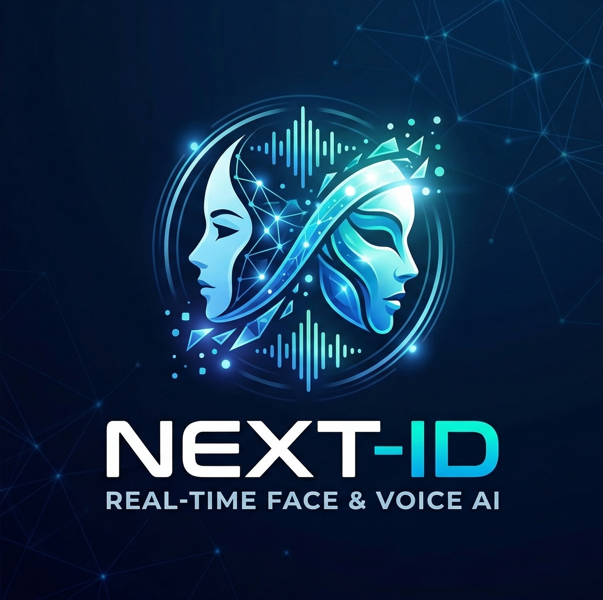

<div align="center">



# NEXT-ID VOICE CLONER

**Clonación de voz de alta fidelidad · 100% local · Sin censura · Tiempo real**

[](https://python.org)
[](https://pytorch.org)
[](https://developer.nvidia.com/cuda-toolkit)
[](LICENSE)
[](https://github.com/julianposada)

</div>

---

## ¿Qué es NEXT-ID Voice Cloner?

**NEXT-ID Voice Cloner** es una suite completa de clonación y conversión de voz que corre **100% en tu máquina**, sin APIs externas, sin límites de uso y sin telemetría. Con tan solo 1–3 minutos de audio de referencia, el sistema genera un modelo de voz personalizado capaz de convertir cualquier entrada en tiempo real con latencia inferior a 150ms.

El pipeline combina tres tecnologías de vanguardia: síntesis zero-shot con **F5-TTS**, conversión de características con **Applio RVC** y supresión neuronal de ruido con **DeepFilterNet3** — todo orquestado en una sola interfaz.

---

## Pipeline Técnico

```
Audio de referencia (1–3 min)
        │
        ▼
┌───────────────────┐
│  F5-TTS Spanish   │  ◄─ Zero-shot: clona tu timbre y lee guiones fonéticos
│  (Juan Gallego)   │     Genera dataset sintético limpio en GPU
└────────┬──────────┘
         │  ~50–200 audios WAV
         ▼
┌───────────────────┐
│   Applio RVC      │  ◄─ Extrae características con RMVPE + ContentVec
│   (Entrenamiento) │     Entrena el modelo de conversión de voz
└────────┬──────────┘
         │  modelo.pth + modelo.index
         ▼
┌──────────────────────────────────────┐
│         Tiempo Real                  │
│                                      │
│  Mic → DeepFilterNet3 → Hold Gate   │
│       → Applio RVC (RMVPE)          │
│       → Salida clonada              │
└──────────────────────────────────────┘
```

---

## Características

- **Clonación zero-shot** — no requiere reentrenamiento por texto; F5-TTS transfiere el timbre de inmediato
- **Conversión en tiempo real** — latencia <150ms, bloque de 32×128 muestras sincronizado con el motor RVC
- **Supresión neuronal de ruido** — DeepFilterNet3 corre a 48kHz nativo en GPU antes del pipeline RVC
- **VAD integrado** — WebRTC-VAD interno de Applio filtra bloques que no contienen voz humana
- **Post-procesamiento profesional** — compresor, limitador y normalización via Pedalboard
- **100% local** — ningún dato sale de tu máquina; compatible con Discord, OBS y VB-Audio Cable
- **Optimizado para Blackwell** — soporte nativo para RTX 5060/5070/5080/5090 (sm_120, CUDA 12.8)

---

## Instalación

### Windows (Recomendado)

```bash
# 1. Instala Miniconda y Git si no los tienes
#    https://docs.conda.io/en/latest/miniconda.html
#    https://git-scm.com/download/win

# 2. Clona el repositorio
git clone https://github.com/elmono010/Next-ID-VoiceCloner
cd next-id-voice-cloner

# 3. Ejecuta el instalador automático
INSTALAR.bat

# 4. Inicia la aplicación
INICIAR.bat
# — o —
NEXT-ID-VC.exe
```

El script `INSTALAR.bat` configura el entorno virtual, instala PyTorch con el backend correcto para tu GPU y descarga los modelos preentrenados automáticamente.

### Linux

```bash
python3 -m venv env && source env/bin/activate
pip install -r requirements.txt
python gui.py
```

> Para GPUs Blackwell en Linux, consulta la sección de optimización RTX 5000 más abajo.

### macOS (Apple Silicon)

```bash
conda create -n voicecloner python=3.10 && conda activate voicecloner
pip install torch torchvision torchaudio          # MPS backend automático
pip install -r requirements.txt
python gui.py
```

> El rendimiento en tiempo real puede variar según el modelo M. La conversión en batch funciona sin limitaciones.

---

## Optimización para RTX 5000 Series (Blackwell / sm_120)

Las versiones estables de PyTorch no incluyen soporte para la arquitectura **Blackwell** (sm_120). Este proyecto usa **PyTorch Nightly compilado con CUDA 12.8** para aprovechar al máximo las RTX 5060, 5070, 5080 y 5090.

**Requisito de driver:** NVIDIA 576.52 o superior.

```bash
# Verifica tu driver
nvidia-smi

# Instala PyTorch Nightly cu128 (ya incluido en INSTALAR.bat)
pip uninstall torch torchvision torchaudio -y
pip install --pre torch torchvision torchaudio \
    --index-url https://download.pytorch.org/whl/nightly/cu128
```

**Instalar DeepFilterNet3** (supresión neuronal de ruido):

```bash
# En el entorno virtual de Applio
env\Scripts\pip install deepfilternet     # Windows
env/bin/pip install deepfilternet         # Linux / macOS
```

---

## Uso

### Crear un modelo de voz

1. Abre la pestaña **🎙️ Crear Modelo**
2. Sube tu audio de referencia (mínimo 10s, ideal 30s–3 min, sin ruido de fondo)
3. Escribe un nombre para el modelo
4. Ajusta el número de audios sintéticos y épocas de entrenamiento
5. Pulsa **INICIAR PIPELINE** — el sistema hace todo automáticamente

El pipeline completo dura entre 20 minutos y 3 horas según la GPU y las épocas configuradas.

### Conversión en tiempo real

1. Abre la pestaña **🔴 Tiempo Real**
2. Selecciona el modelo `.pth` y el índice `.index` creados
3. Elige tu micrófono de entrada y la salida de audio
4. Ajusta el **Tono (Pitch)** si necesitas cambiar de registro (ej. −12 para masculinizar, +12 para feminizar)
5. Configura la **Puerta de ruido** según tu entorno: −45 dB para oficina, −55 dB para habitación silenciosa
6. Pulsa **▶ INICIAR** y habla — tu voz sale convertida en tiempo real

**Para usar con Discord / OBS:**
1. Instala [VB-Audio Virtual Cable](https://vb-audio.com/Cable/)
2. Selecciona *CABLE Input* como salida en esta aplicación
3. En Discord u OBS, selecciona *CABLE Output* como micrófono de entrada

---

## Preparación del Audio de Referencia

La calidad del modelo final depende directamente del audio que le des. Sigue estas pautas para obtener el mejor resultado:

**✅ Audio ideal**
- Duración entre 30 segundos y 3 minutos (más no siempre es mejor)
- Grabado en habitación silenciosa, sin eco ni reverb
- Una sola persona hablando continuamente, sin música ni efectos
- Formato WAV o FLAC a 44.1kHz o 48kHz, mono o estéreo
- Volumen consistente, sin picos que saturen ni silencios largos
- Habla natural y variada en entonación — no leer en voz monótona

**❌ Evitar**
- Audio con ruido de fondo intenso (ventilador, música, tráfico)
- Grabaciones telefónicas o comprimidas (MP3 de baja calidad)
- Voz procesada con efectos, autotune o ecualizadores
- Múltiples voces o sonidos superpuestos
- Clips muy cortos (menos de 10 segundos)

> **Consejo:** Si solo tienes audio ruidoso, herramientas como Adobe Podcast Enhance o LALAL.AI pueden limpiarlo antes de subirlo.

---

## Creación del Dataset Sintético

El sistema no entrena directamente con tu audio de referencia. En su lugar, usa **F5-TTS Spanish** para generar un dataset limpio y fonéticamente diverso clonando tu timbre. Esto garantiza que el modelo RVC aprenda de audio perfectamente etiquetado y sin ruido.

### Cómo funciona

1. **F5-TTS analiza tu audio de referencia** y extrae el perfil tímbrico de tu voz (tono, textura, cadencia) sin necesidad de transcripción.

2. **Se seleccionan textos fonéticos balanceados** — guiones en español diseñados para cubrir todas las combinaciones de fonemas, sílabas y patrones de entonación. El selector elige automáticamente según el modo configurado.

3. **F5-TTS sintetiza cada texto** usando tu timbre como referencia. El resultado es una colección de audios WAV donde tu voz clonada pronuncia frases variadas en condiciones perfectas de estudio.

4. **El dataset se almacena** en `output/dataset/` listo para el entrenamiento.

### Parámetros del dataset

| Parámetro | Descripción | Recomendado |
|---|---|---|
| **Nº de audios** | Cantidad de clips sintéticos a generar | 80–150 |
| **Velocidad** | Factor de velocidad del habla (1.0 = natural) | 0.9–1.1 |
| **Modo de textos** | Cobertura fonética: Rápido / Estándar / Exhaustivo | Estándar |

> Con 100 audios el entrenamiento tarda ~1–2 horas en una RTX 4060. La calidad mejora con más datos hasta ~150 clips; después los rendimientos son decrecientes.

---

## Entrenamiento del Modelo

Una vez generado el dataset, Applio RVC lo procesa en tres fases automáticas:

### Fase 1 — Preprocesado
Applio recorta el dataset en segmentos de ~3 segundos, aplica un filtro de paso alto para eliminar frecuencias bajas no vocales y normaliza la amplitud. Los archivos se guardan en dos versiones: a la frecuencia de muestreo objetivo (40kHz por defecto) y a 16kHz para la extracción de características.

### Fase 2 — Extracción de características
- **RMVPE** analiza cada clip y extrae la curva de pitch (F0) con precisión de medio semitono — el mismo algoritmo usado en tiempo real.
- **ContentVec** convierte cada clip en embeddings de 768 dimensiones que representan el contenido fonético independientemente del timbre. Esto es lo que permite transferir una voz a otra.

### Fase 3 — Entrenamiento
El modelo RVC aprende a mapear los embeddings ContentVec + pitch de cualquier voz de entrada a los embeddings de tu voz. Se guarda un checkpoint cada 10 épocas.

### Parámetros de entrenamiento

| Parámetro | Descripción | Valores típicos |
|---|---|---|
| **Épocas** | Ciclos completos sobre el dataset | 100–300 (empieza con 150) |
| **Batch size** | Clips procesados por paso | 4–8 según VRAM disponible |
| **Sample rate** | Frecuencia de muestreo del modelo | 40000 Hz (recomendado) |

> El **detector de sobreentrenamiento** está activo por defecto. Si el modelo empieza a memorizar en lugar de generalizar, detiene el entrenamiento automáticamente antes de degradar la calidad.

### Archivos generados

Al terminar, el sistema copia automáticamente los archivos a `output/models/`:

```
output/
└── models/
    ├── nombre_modelo.pth      ← Pesos del modelo
    └── nombre_modelo.index    ← Índice FAISS (mejora fidelidad del timbre)
```

El archivo `.index` contiene los embeddings de referencia de tu voz. Cuando el **Index Ratio** está alto (0.75–0.9) en tiempo real, el motor lo usa para anclar la conversión más cerca de tu timbre original.

---

## Tecnologías

| Componente | Proyecto | Función |
|---|---|---|
| [F5-TTS Spanish](https://github.com/SWivid/F5-TTS) | Juan Gallego | Síntesis zero-shot para generación de dataset |
| [Applio RVC](https://github.com/IAHispano/Applio) | IAHispano | Motor de conversión de voz en tiempo real |
| [RMVPE](https://github.com/Dream-High/RMVPE) | — | Extracción de pitch de alta precisión |
| [ContentVec](https://github.com/auspicious3000/contentvec) | — | Embeddings de contenido fonético |
| [DeepFilterNet3](https://github.com/Rikorose/DeepFilterNet) | Rikorose | Supresión neuronal de ruido a 48kHz |
| [Pedalboard](https://github.com/spotify/pedalboard) | Spotify | Post-procesamiento de audio (compresor, limitador) |

---

## Contribuir

¿Quieres mejorar NEXT-ID Voice Cloner? Las contribuciones son bienvenidas.

```bash
# Fork → Clone → Branch → PR
git checkout -b feature/mi-mejora
git commit -m "feat: descripción clara del cambio"
git push origin feature/mi-mejora
```

Áreas donde se necesita ayuda: soporte multi-GPU, interfaz web mejorada, empaquetado para distribución, documentación en inglés.

---

## Licencia

Distribuido bajo la **Licencia MIT**. Puedes usar, modificar y redistribuir este proyecto libremente siempre que mantengas los créditos correspondientes a los proyectos base.

---

<div align="center">

Desarrollado por **Julian Posada** · 2026

*Si el proyecto te fue útil, una ⭐ en GitHub ayuda a que más personas lo encuentren.*

</div>
